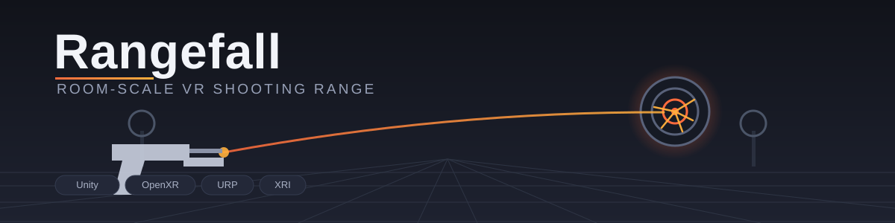
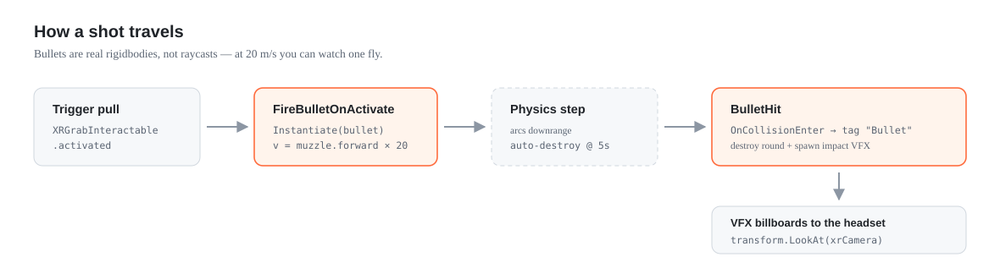
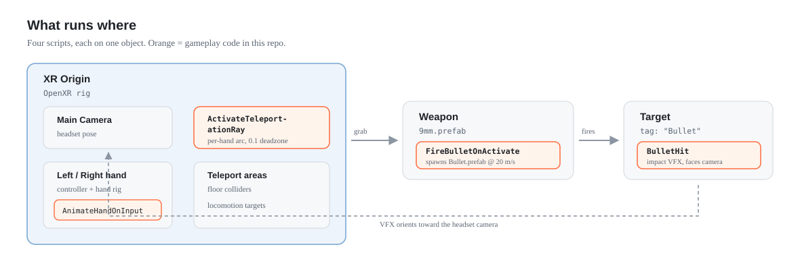
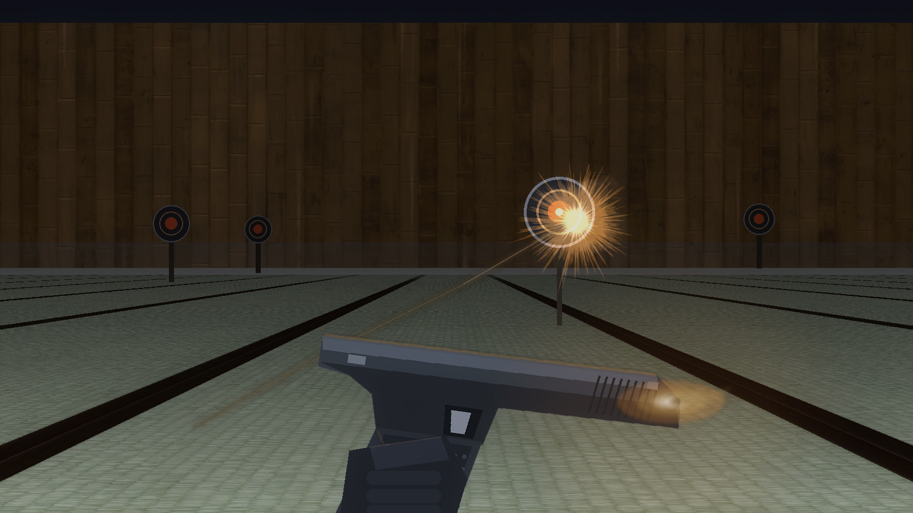
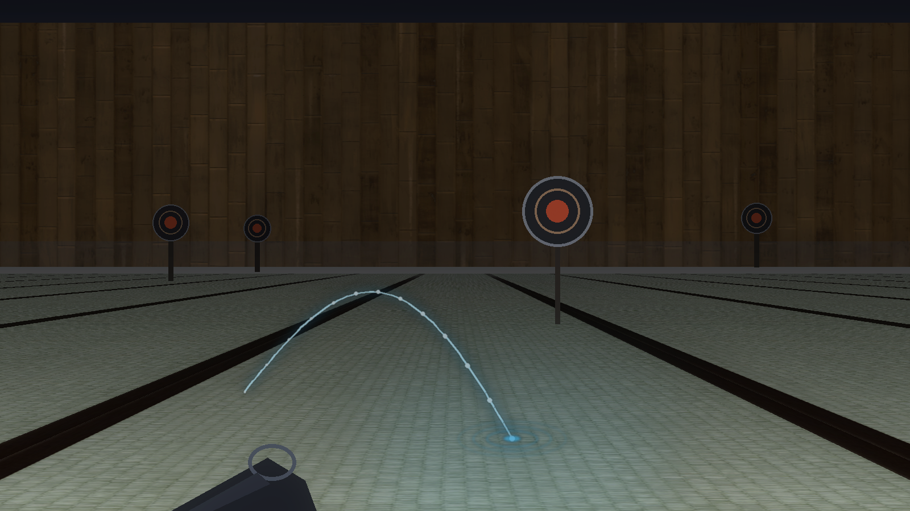

<div align="center">

# 🎯 Rangefall



**A room-scale VR shooting range built in Unity, running on OpenXR.**

Grab the pistol. Pull the trigger. Watch the steel ring.

[](https://unity.com/releases/editor/whats-new/2021.3.8)
[](https://docs.unity3d.com/Packages/com.unity.xr.openxr@1.6/manual/index.html)
[](https://docs.unity3d.com/Packages/com.unity.xr.interaction.toolkit@2.2/manual/index.html)
[](https://docs.unity3d.com/Packages/com.unity.render-pipelines.universal@12.1/manual/index.html)
[](LICENSE)

</div>

---

## What this is

Rangefall is a compact VR firearms sandbox — a target range you walk into, pick a weapon up off the bench, and shoot. There is no score, no timer, and no fail state. It exists to make the *feel* right: the weight of a grab, the snap of a trigger pull, the particle burst when a round lands where you aimed.

It's also a readable reference implementation. Every mechanic in the game is one short `MonoBehaviour`, none longer than forty lines. If you're learning XR Interaction Toolkit and want to see grab-to-shoot and teleport locomotion without wading through a framework, the whole of it is in [`Assets/`](Assets/) and you can read it in ten minutes.

> **Heads up:** the render target is **OpenXR**, not the vendor-specific Oculus SDK. That means it runs on Quest, but equally on Index, Vive, WMR, or anything else with a conformant OpenXR runtime.

---

## The four mechanics

The entire game is these four scripts. That's the whole thing.

| Script | What it does |
| :-- | :-- |
| [`FireBulletOnActivate.cs`](Assets/FireBulletOnActivate.cs) | Hooks the XRI `activated` event on a grabbable weapon. On trigger, spawns a bullet prefab at the muzzle and launches it forward at `fireSpeed`. Self-destructs after 5s so the scene never fills with strays. |
| [`BulletHit.cs`](Assets/BulletHit.cs) | Lives on targets. On collision with a `Bullet`-tagged rigidbody, destroys the round and spawns an impact particle system — rotated to face the headset, so the burst always reads correctly regardless of where you're standing. |
| [`ActivateTeleportationRay.cs`](Assets/ActivateTeleportationRay.cs) | Per-hand teleport arcs. Shows the ray when the thumbstick pushes past a 0.1 deadzone, and suppresses it while the cancel action is held — so aiming a teleport never fights with grabbing. |
| [`AnimateHandOnInput.cs`](Assets/AnimateHandOnInput.cs) | Drives the hand rig's `Trigger` and `Grip` animator floats straight from the analog input values, so fingers curl proportionally instead of snapping between poses. |

### How a shot actually travels



Bullets are real rigidbodies, not raycasts. They arc, they take time to arrive, and at 20 m/s you can watch one travel downrange.

### Where each script lives



---

## Gallery





---

## Running it

<details open>
<summary><strong>Prerequisites</strong></summary>

- **Unity 2021.3.8f1** (LTS) — other 2021.3 patches will almost certainly open fine, but this is the pinned version
- The **Android Build Support** module, if you're deploying to a standalone headset
- An OpenXR-capable headset and runtime

</details>

<details open>
<summary><strong>In the editor (fastest path)</strong></summary>

1. Clone the repo and open the project folder in Unity Hub
2. Let the first import finish — it pulls XRI, OpenXR, and URP and will take a few minutes
3. Open **`Assets/Scenes/mainScene.unity`** — this is the built-out range
4. Connect your headset over Link / Air Link / SteamVR and press **Play**

</details>

<details>
<summary><strong>Deploying to a standalone headset</strong></summary>

1. **File → Build Settings → Android**, then *Switch Platform*
2. Under **Project Settings → XR Plug-in Management → Android**, confirm **OpenXR** is ticked and an interaction profile matching your controllers is added
3. Enable developer mode on the headset and plug it in over USB
4. **Build and Run**

> ⚠️ The build list currently ships `SampleScene` rather than `mainScene`. Add `mainScene` and move it to index 0 before building, or you'll deploy an empty room.

</details>

---

## What's in the box

```
Assets/
├── Scenes/
│   ├── mainScene.unity        ← the range. start here
│   └── SampleScene.unity      ← empty URP template scene
├── *.cs                       ← all four gameplay scripts, flat at the root
├── 9mm.prefab, Bullet.prefab  ← weapon + projectile
├── Pistol/, 9-mm/             ← firearm models and materials
├── LowPoly Guns/              ← additional weapon set (+ Demo.unity)
├── keith-thomson-rifle/       ← rifle asset
├── Oculus Hands/              ← animated hand rig
├── Hits/                      ← impact VFX, with three showcase scenes
├── XR/, XRI/                  ← input action maps and rig presets
└── Settings/                  ← URP quality tiers
```

---

## Tuning it

Most of the feel lives in inspector values, not code:

| Knob | Where | Default | Try |
| :-- | :-- | :-- | :-- |
| Muzzle velocity | `FireBulletOnActivate.fireSpeed` | `20` | `60`+ for a flat trajectory; `8` to make arcs obvious |
| Bullet lifetime | `FireBulletOnActivate`, hardcoded | `5s` | Shorten on large scenes to cut physics load |
| Teleport deadzone | `ActivateTeleportationRay` | `0.1` | Raise to `0.3` if the arc flickers on a loose stick |
| Impact VFX | `BulletHit.hitVfx` | — | Swap the particle system for a different hit read |

---
